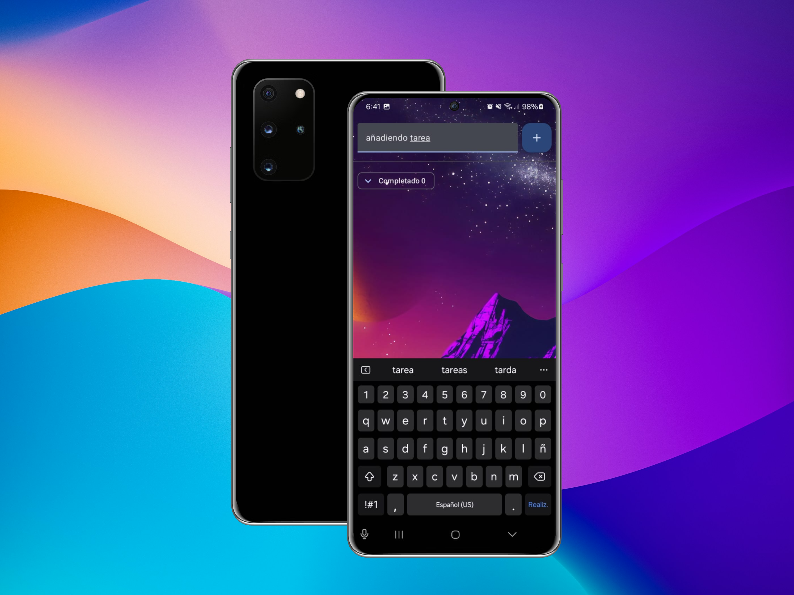

# ListTask App

ListTask App es una aplicación de gestión de tareas simple y eficiente, diseñada para ayudarte a organizar tus pendientes de manera rápida y sencilla.

## Características

- Añadir nuevas tareas con un solo clic.
- Eliminar tareas completadas.
- Interfaz limpia y fácil de usar.
- Guardado automático de tareas.
- Funcionalidad responsiva para dispositivos móviles.

## Capturas de pantalla

 

## Instalación

1. Clona el repositorio:
   ```bash
   git clone https://github.com/WatsiDev/ListTask-App.git
